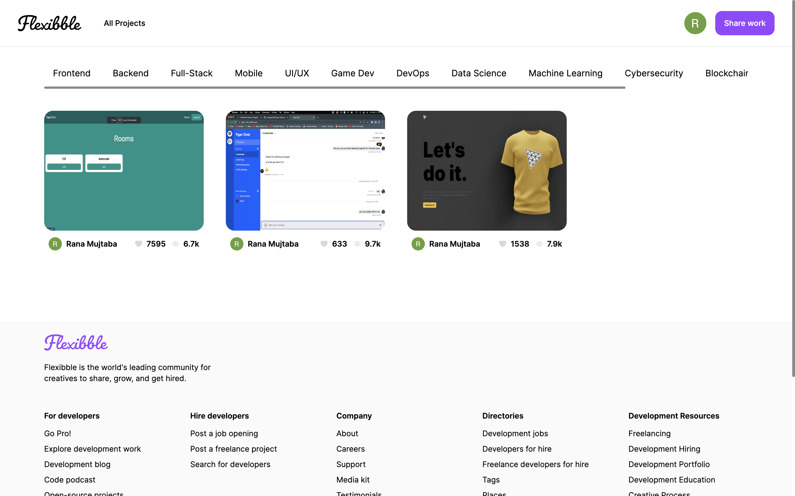

# Dribbble Clone: Flexxxible
## TypeScript, React, Next.js, GraphQL, TailwindCSS

Full-stack web application.  
A web-based platform where users can post their projects, maintain user profiles, and seamlessly execute CRUD (Create, Read, Update, Delete) operations.    
Designed using front-end technologies such as React, TypeScript and TailwindCSS. Backend powered by Next.js and GraphQL.

